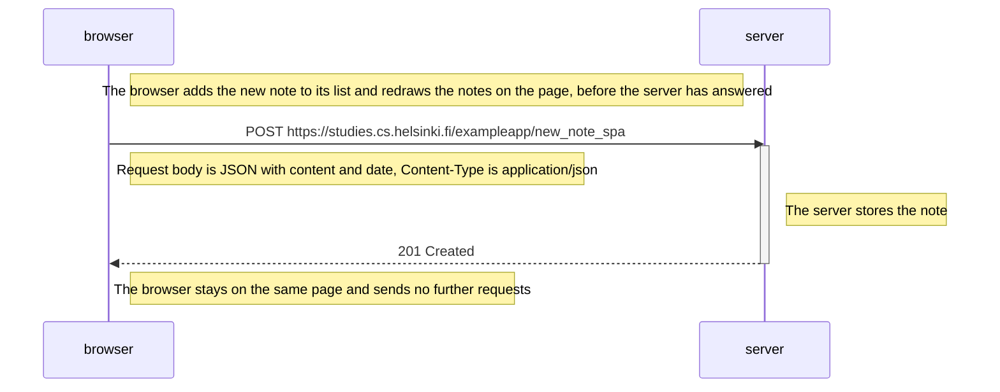

```mermaid
sequenceDiagram
    participant browser
    participant server

    Note right of browser: The browser adds the new note to its list and redraws the notes on the page, before the server has answered

    browser->>server: POST https://studies.cs.helsinki.fi/exampleapp/new_note_spa
    activate server
    Note right of browser: Request body is JSON with content and date, Content-Type is application/json
    Note right of server: The server stores the note
    server-->>browser: 201 Created
    deactivate server

    Note right of browser: The browser stays on the same page and sends no further requests
```
